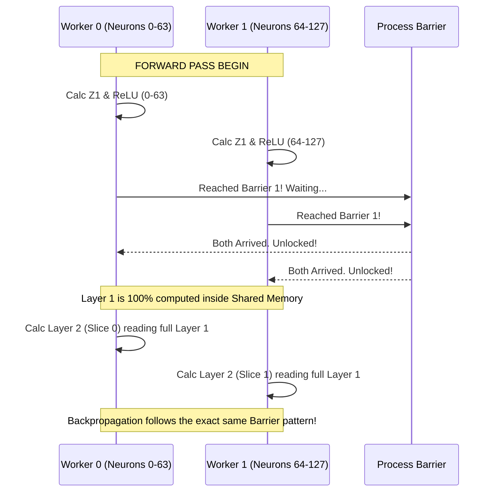

# Multiprocessing Neural Network Architecture

This document breaks down how the mathematical Neural Network maps strictly against Operating System concurrency concepts.

## 1. The Mathematical Model (The Neural Network)
The network is a pure **Multi-Layer Perceptron (MLP)** built from scratch without external math libraries like PyTorch or NumPy. 

### Architecture Topology
* **Input Layer (`A0`)**: 784 nodes represent the 28x28 normalized pixels of an MNIST image.
* **Hidden Layer (`A1`)**: 256 neurons, acting as the feature extractors. The activation function used here is **ReLU** (Rectified Linear Unit), forcing any negative outputs to zero.
* **Output Layer (`A2`)**: 10 neurons, mapping to the digit predictions (0 through 9). The activation used here is **Softmax**, squashing the numbers into a probability distribution that always adds up exactly to 1.
* **Cost Function**: **Categorical Cross-Entropy**. This calculates how far off our probability guess was from the true digit label.
* **Optimizer**: **Stochastic Gradient Descent (SGD)**. We update the network weights and biases incrementally for every single image we process, rather than doing bulk batching.

---

## 2. The Operating System Architecture (The Implementation)
To simulate the physical layer separation found across multiple GPUs (like the split pipeline inside AlexNet), we distribute horizontal "slices" of the neurons across separate independent processes.

### Component Layout
We leverage four key POSIX (Portable Operating System Interface) components for horizontal scaling:

1. **`mmap` and `shm_open` (Zero-Copy Shared Memory)** 
   If a parent process calls `fork()`, the child technically gets an exact copy-on-write duplicate of memory. However, they wouldn't easily be able to see each other's state updates! 
   We solved this by mapping our `SharedMemoryData` straight into the OS kernel's tmpfs via `/dev/shm`. Processes 0, 1, 2, and 3 all get pointer accesses pointing to the exact same physical RAM byte addresses.

2. **The "Slicing" Mechanism (`fork`)**
   After loading the dataset with `std::thread`, the central Master orchestrator `fork()`s out 4 distinct Worker sub-processes.
   To avoid race conditions, no two processes govern the same neuron.
   * **Worker 0** takes full control of Hidden Neurons `0 to 63`.
   * **Worker 1** takes Hidden Neurons `64 to 127`.
   * **Worker 2** takes Hidden Neurons `128 to 191`.
   * **Worker 3** takes Hidden Neurons `192 to 255`.
   
   Every worker individually loops over the dataset and calculates matrix multiplications solely limited to its neuron bounds. 

3. **Layer Latches (`pthread_barrier_t`)**
   A neural network is highly sequential (Layer 2 cannot start until Layer 1 has entirely finalized its math). Since the OS native scheduler might pause Worker 0 while giving pure CPU time to Worker 1, we must actively choke them into alignment.
   

4. **Critical Section Locking (`pthread_mutex_t`)**
   Inside the `backward_pass()`, Worker 0 calculates exactly how inaccurate the network predictions were (`epoch_loss`). Without a Mutex, another Process could accidentally start modifying variables concurrently resulting in invalid pointers or memory overwrites. We initialize a globally shared OS Lock to ensure variables like `epoch_loss` are safely written to synchronously.

### The Ultimate Goal
Instead of keeping 3 cores sitting absolutely idle at 0% usage while 1 Core processes deep learning math, this exact OS implementation forces the OS Scheduler to blast all 4 Cores sequentially to 100% usage, calculating segments of matrix math in physical parallelism!
